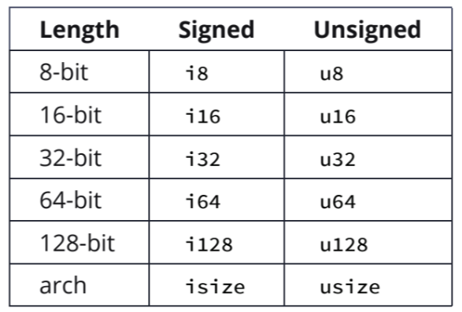
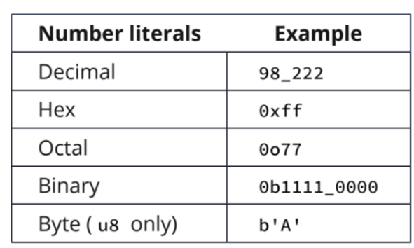

## Notes :memo:

**Comandos cargo**

Cria um novo projeto
```rust
cargo new
```

Compila o código
```rust
cargo build
```

Compila com otimizações
```rust
cargo build --release
```

Compila e executa o código
```rust
cargo run
```

Confere se o código é compilável
```rust
cargo check
```

Verifica as últimas versões dos packages e salva no Cargo.lock
```rust
cargo update
```

#

#### Variáveis
 - O **println!** é uma macro (!) 
 - Variáveis são imutáveis por padrão (para mudá-las usamos o *mut*)
 - Constantes são sempre imutáveis e seu tipo deve ser anotado
 - Para usar o *shadowing* as variáveis não precisam ser mutáveis

#### Tipos de dados
 - Temos dois subconjuntos de tipos de dados *Scalar* and *Compound*
 - O Rust deve saber o tipo de todas as variáveis em tempo de compilação
  **Scalar types**
   - Integers
  
   - Floating Points
   - Boolean
   - Characters - Possuem 4bytes (Unicode)
   - Number literals
  
  **Compound types**
   - Tuples - Aceitam dados de vários tipos e possuem tamanho fixo
   - Arrays

Parei em array types pg 58
